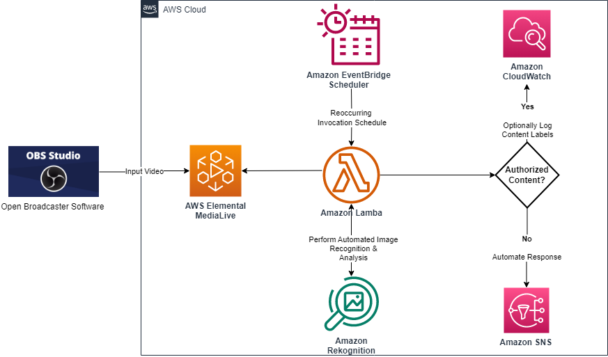

Copyright Amazon.com, Inc. or its affiliates. All Rights Reserved.

Permission is hereby granted, free of charge, to any person obtaining a copy of this
software and associated documentation files (the "Software"), to deal in the Software
without restriction, including without limitation the rights to use, copy, modify,
merge, publish, distribute, sublicense, and/or sell copies of the Software, and to
permit persons to whom the Software is furnished to do so.

THE SOFTWARE IS PROVIDED "AS IS", WITHOUT WARRANTY OF ANY KIND, EXPRESS OR IMPLIED,
INCLUDING BUT NOT LIMITED TO THE WARRANTIES OF MERCHANTABILITY, FITNESS FOR A
PARTICULAR PURPOSE AND NONINFRINGEMENT. IN NO EVENT SHALL THE AUTHORS OR COPYRIGHT
HOLDERS BE LIABLE FOR ANY CLAIM, DAMAGES OR OTHER LIABILITY, WHETHER IN AN ACTION
OF CONTRACT, TORT OR OTHERWISE, ARISING FROM, OUT OF OR IN CONNECTION WITH THE
SOFTWARE OR THE USE OR OTHER DEALINGS IN THE SOFTWARE.

# MediaLive Thumbnail Detection with Rekognition 

## Getting Started with the AWS CDK
- Prerequisites: 
    - Install [Node.js](https://nodejs.org/en/download): 
      > All supported languages, Python, Java, or C# use the same backend, which runs on Node.js. AWS recommends selecting a version in active long-term support. 

    - Install the AWS CDK Toolkit:  
      - `npm install -g aws-cdk`

    - [Bootstrap](https://docs.aws.amazon.com/cdk/v2/guide/bootstrapping.html) your AWS Account
      > You must run bootstrap your AWS account to deploy CDK solutions. This command has to be run at least once per AWS Account:

      - `cdk bootstrap `

## Deploy this Solution:  
  > Note: This solution assumes an active MediaLive Channel is running 

  - Clone with repo to your local compute system: 
    - `git clone https://github.com/vaughngit/cdk-ts-medialive-preview-thumbnail-rekognition.git`

  - Navigate to the root of the directory:
    - ` cd cdk-ts-medialive-preview-thumbnail-rekognition\`

  - Install the project binaries
    - `npm install`

  - Deploy the solution to your AWS account
    > Update the snsEmail and channelId parameter values to reflect your environment: 
  
    - ` cdk deploy --parameters snsEmail=myemail@example.com --parameters channelId=1234567  --parameters pipelineId=0 `
      > The specified email will receive a SNS Subscription Confirmation email upon successful deployment. Be sure to click the confirmation link in the email to receive notifications from the solution when a sports streaming event is detected. 

    > For more information on parameters see AWS documentation for [CloudFormation Parameters](https://docs.aws.amazon.com/cdk/v2/guide/parameters.html#parameters_use) in CDK: 

## Create Additional Schedulers:
  - You do not need to deploy this solution multiple times to monitor additional MediaLive Channels or modify the scheduler. Simply create additional custom schedules to leverage this solution on multiple MediaLive Channels and invoke monitoring at different time intervals. 
  
  - see instructions [here](./docs/Notes.md)

## Clean Up Instructions

  - Delete all resources created by the CDK Project
    - `cdk destroy `
    - type `y` to confirm deletion

  - If created additional schedulers remember to run the terminal commands labeled with `delete scheduler:` text for each additional scheduler created via the AWS CLI and AWS Lambda as provided [here](./docs/Notes.md) . 

## Other Useful commands

- The `cdk.json` file tells the CDK Toolkit how to execute your app.

* `npm run build`   compile typescript to js
* `npm run watch`   watch for changes and compile
* `npm run test`    perform the jest unit tests
* `cdk deploy`      deploy this stack to your default AWS account/region
* `cdk diff`        compare deployed stack with current state
* `cdk synth`       emits the synthesized CloudFormation template